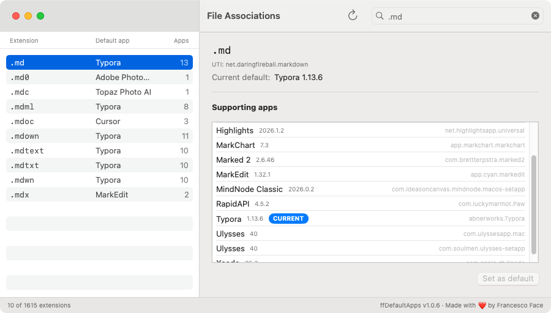

# Always with

A small macOS utility to view and change file type associations, built with SwiftUI.



## What it does

- Scans `/Applications` for installed apps and reads each `Info.plist` to find which file extensions they declare support for.
- Resolves the UTI for every extension and queries Launch Services for the current default app.
- Lets you pick any extension and reassign its default app among the ones that declared support.

## Requirements

- macOS 15.6 or later
- Xcode 26 or later (to build)

## Build & run

Open `AlwaysWith.xcodeproj` in Xcode and ⌘R, or from the command line:

```sh
xcodebuild -project AlwaysWith.xcodeproj -scheme AlwaysWith -configuration Debug -destination 'platform=macOS' build
```

## Tests

```sh
xcodebuild -project AlwaysWith.xcodeproj -scheme AlwaysWith -destination 'platform=macOS' test
```

The test target uses Swift Testing.

## Notes on Launch Services APIs

`LSCopyDefaultApplicationURLForContentType` and `LSSetDefaultRoleHandlerForContentType` are deprecated since macOS 12 but they are still the only way to read and set default handlers — there is no fully modern replacement yet. The deprecation warnings on those two call sites are expected.

## License

Personal project. No license set.

---

Made with ❤️ by Francesco Face
